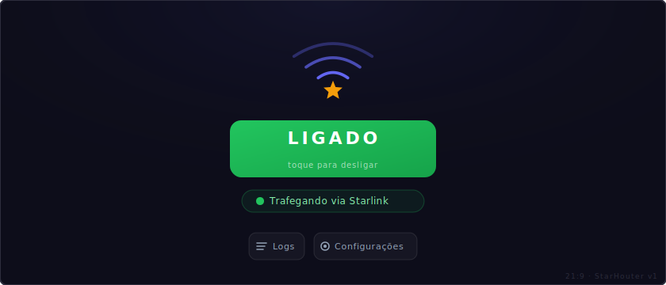

# Starlink Router

Aplicativo Android de propósito único para **minha própria head unit Haval**. Executa o daemon **Starlink Router**:
faz a ponte do tráfego do hotspot Wi-Fi do carro pelo uplink externo Starlink (`wlan0`)
quando acessível, com fallback para o 4G OEM (`vlan13`) caso contrário.

Não está em nenhuma loja. Instalado apenas no meu carro, assinado com minha própria chave.

## UI



Uma tela (paisagem 21:9):

- Botão de alternância grande **LIGADO / DESLIGADO**
- Chip: `Trafegando via Starlink` ou `Trafegando via 4G`
- Botões de ação horizontais (ícone + texto): **Logs** e **Configurações**

Inicia automaticamente no boot, restaura o último estado ligado/desligado — sem necessidade de abrir o app.

## Como funciona

- **Zero dependências** — apenas Android SDK. Java. Sem AndroidX, sem Compose, sem Shizuku, sem biblioteca telnet.
- Trabalho de root (`ip rule`, `iptables`, daemon) é executado através do shell telnet da head unit em
  `127.0.0.1:23`, acessado por um cliente raw-socket de ~100 linhas
  ([`TelnetRoot.java`](app/src/main/java/com/castilhoduarte/starlinkrouter/TelnetRoot.java)).
- Shell acessível apenas se o uid do app for ≤ 10999 — requer instalação através da janela de exploit do Frida
  (veja [`scripts/install.sh`](scripts/install.sh)).
- Daemon: [`starlinkrouter.sh`](app/src/main/assets/starlinkrouter.sh) — enviado para `/data/local/tmp`,
  supervisionado por um watchdog de 60s. NAT/forwarding autogerenciado, independente das chains
  `tetherctrl_*` do sistema. Histerese previne flapping.

Design completo: [`docs/DESIGN.md`](docs/DESIGN.md).

## Build / release

- **Pull request → `assembleDebug`** (verificação de compilação, sem segredos).
- **Merge para `main` → `assembleRelease` assinado** → publicado como release do GitHub com APK.

Segredos de assinatura no Actions: `KEYSTORE_BASE64`, `STORE_PASSWORD`, `KEY_PASSWORD`, `KEY_ALIAS`.

## Instalar no carro

Via telnet ou shell da multimídia, de qualquer pasta:

```sh
curl -fsSL https://raw.githubusercontent.com/jucastilhoduarte/starlinkrouter/main/scripts/install.sh | sh
```

Baixa os binários do Frida do release `exploit-bins` e o APK do último release automaticamente.

## Instalar qualquer APK (bypass da multimídia)

Para instalar APKs externos que a multimídia bloqueia (ex: LibreTube, NewPipe, etc.):

```sh
curl -fsSL https://raw.githubusercontent.com/jucastilhoduarte/starlinkrouter/main/scripts/install-apk.sh | sh -s -- <url-do-apk>
```

Exemplo:

```sh
curl -fsSL https://raw.githubusercontent.com/jucastilhoduarte/starlinkrouter/main/scripts/install-apk.sh | sh -s -- https://github.com/libre-tube/LibreTube/releases/download/v0.27.2/LibreTube.apk
```

Aceita `.apk` direto ou `.zip` contendo `.apk`. Binários do Frida são cacheados em `/data/local/tmp` — downloads subsequentes pulam as fases 1–2.
